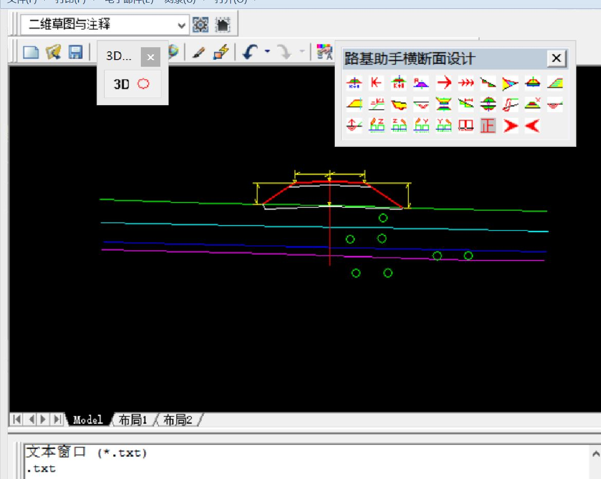
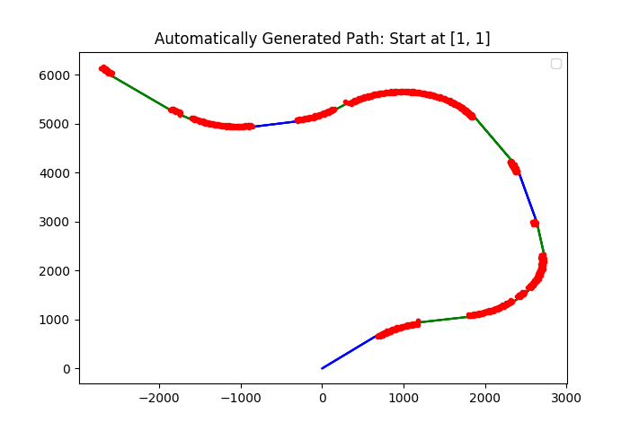
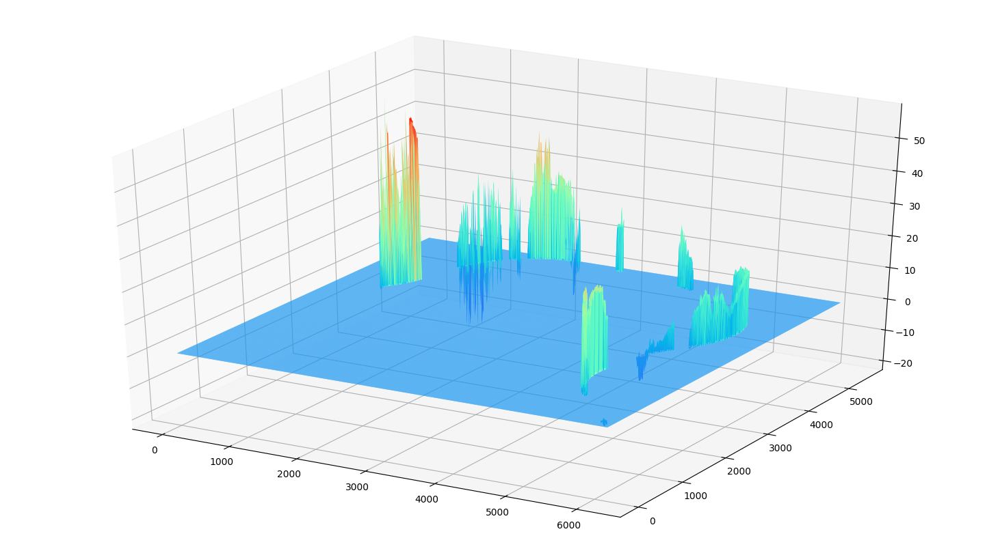
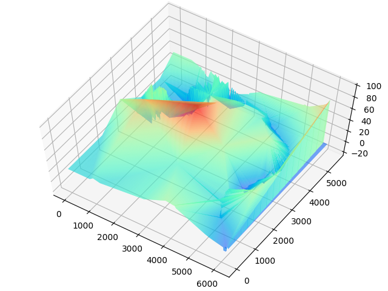
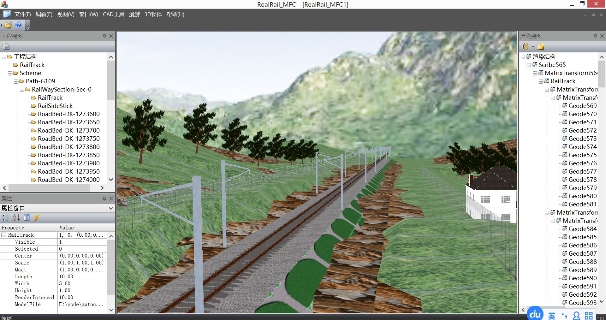

# Building a specific 3D-Design Software

[(Back to Index.html)](../index.html)

The project was designed to develop a specific 3D-design software for transportation. The 2D diagrams in AutoCAD could be automatically transformed into 3D scenes. This project will be used in VR as a extension in the future.

## Background
In transportation construction, 2D diagrams in AutoCAD are often designed before engineering work starts. The 2D diagrams look abstract to human beings, with more imagination needed to give details.

## Accomplishment
To modelling the diagram, data analysis is needed to adapt to the 3D framework. Take a railway as the example.

- First, we generate an line as the railway path.

- After that, we assign the height to each point on the line.

- To make the railway closer to reality, some ground points are made.

## Run

After preparing the 3D-model's data, we then render the model use a 3D-engine, where textures and objects are anded to make the 3D scene clearer.

Not bad, isn't it?