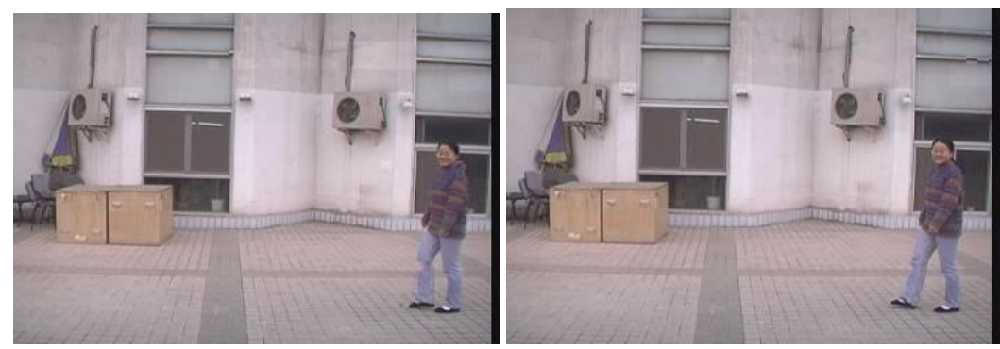
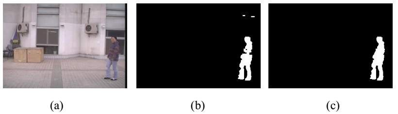
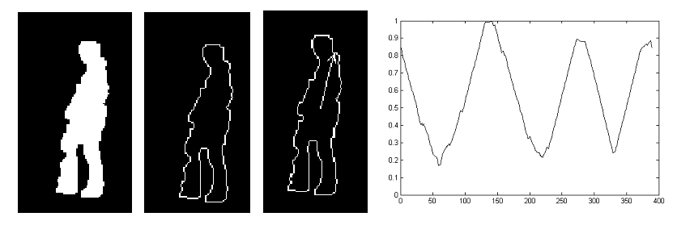
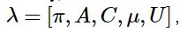
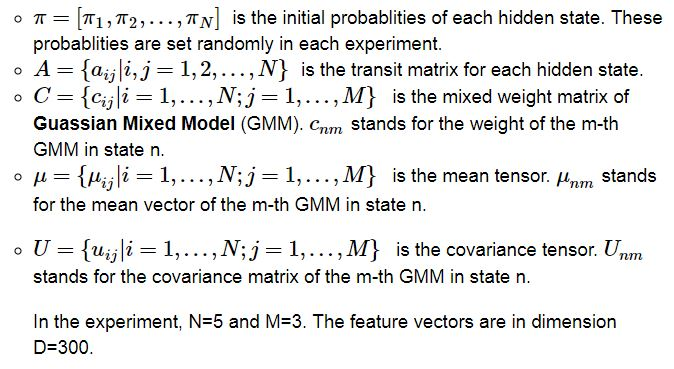
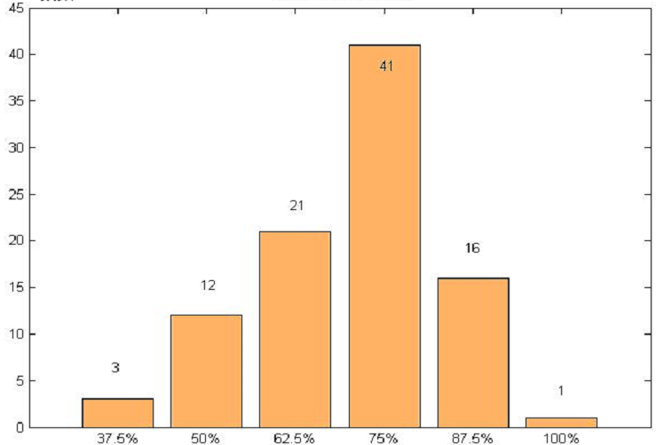

# Research on Gait based Human Recognition

[(Back to Index.html)](../index.html)

This project began in April 2012 and lasted for one year.

## Background
Gait means the posture of a walking person. Gait recognition uses gait to recognize human bodies. Taking the 24 styles of the gait into consideration, it is believed that the people's gait is identical[1]. Compared with finger prints, faces and other biological features, gait recognition is superior in longer distance, non-touch, and hard-to-cheat. It's valuable in public camera surveillance, criminal investigation and medical judgement.

> [1] Murray M P, Drought A B, Kory R C. Walking patterns of normal men[J]. The Journal of Bone & Joint Surgery, 1964, 46(2): 335-360.

The pictures above are a continuous series of photos of a walking woman. The data are from CASIA[2].

> [2] Gait database http://www.cbsr.ia.ac.cn/english/Gait%20Databases.asp

## Accomplishment
This research uses HMM as a major method for recognition. HMM is a kind of signal pattern processing tool with strong ability to modeling time series, which has been used widely in speech recognition. As gait sequences have timing periodic property, which can be seen as the hidden states, this research introduces HMM for gait recognition. When training, extract contour centroid distance as gait characteristics; then, use CHMM to process continuous data, GMM to initialize CHMM’s parameters and Baum-Welch algorithm to re-estimate parameters, in order to build up CHMM for each person; finally get the maximum probability of test sequences by forward algorithm to recognize each person.

- First, the input images are binarized after background removal and filtering.

- Second, the features are retrieved after taking the contour of the person. Features are get by the distance from the contour points to center points, with the increase of the angles.

- Finally, an Continuous HMM model is used to train and test:

where

In the experiment, N=5 and M=3. The feature vectors are in dimension D=300.

## Run

After 100 times experiments, the results are shown in the following picture.

The x-axis values are accuracy, while the y-axis values are the frequency. Each experiment may have different accuracy due to the randomly generated initial parameters.