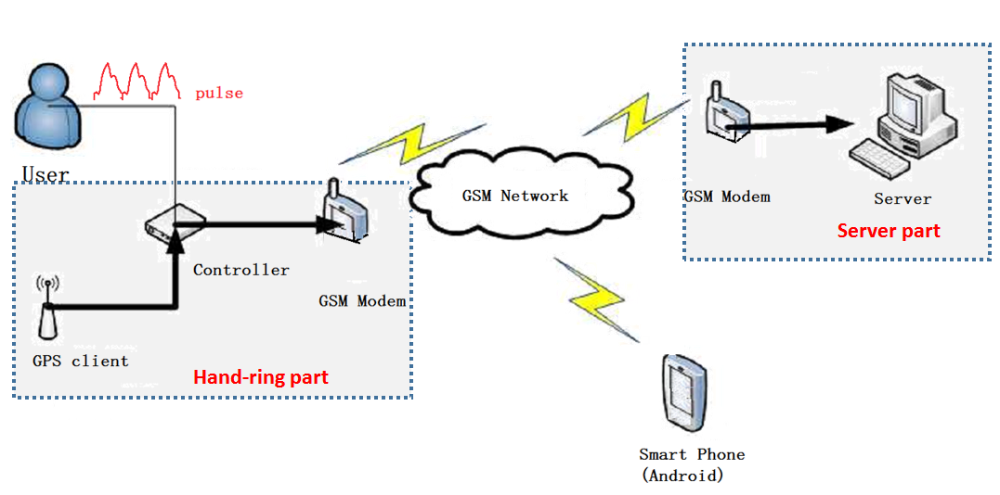

# A Hand-ring System with Pulse-Measurement and Locating Service

[(Back to Index.html)](../index.html)

This project began in April 2012 and lasted for one year.

## Background
This project was supported by the fund for undergradute students from the Zhejiang Province government. It aimed to build an on-hand-system, which was monitoring the user's pulse continuously. Once the user's pulse became abnormal, the system would send location message to the user's families and call for help. The system was designed mainly for the old people, whose abnormal pulse signals indicated heart attacks.

## Accomplishment
The system had three parts: a handring, an App of smart cellphone and a server. The handring was put on the wrist of the users. The apps were installed by the users family memebers, monitering the health status of the users. The servers received the information from the handring and handout to the apps. The procedures are as follows.

- First, the hand-ring part kept measuring the pulse of the user.
- If abnormal pulse signals were detected and didn't go back to normal, the controller of the hand-ring part collected the GPS location, sent emergency message to the server part, and alarmed for help.
- The server part was always ready to receive messages from the hand-ring part. Once the emergency messages were received, it would inform the smart phone app part.
- The app in the smart phone could parse short messages from the server part, and once an emergency message was received, the smart phone would ring, and at the same time invoked a map displaying the location.

## Run

The result was captured shown in the following picture.

At the top right corner, a circuit model of the hand-ring part is displayed, including a pulse sensor, a GPS client, a GSM modem, the controller and etc. Below is the server's main page, showing the map of the location and the emerrgency messages. At the top left corner, the Android app is displayed.