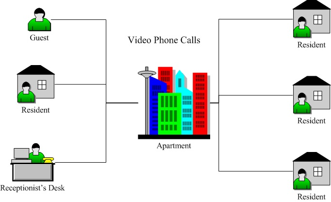
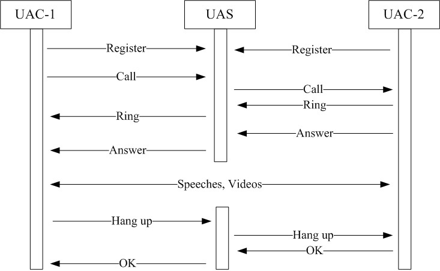
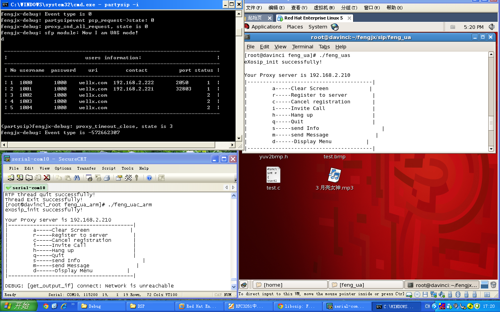

# Embeded Visual IP Telephone

[(Back to Index.html)](../index.html)

This project began in July 2012 and lasted for two months.

## Background
The project was a branch of the smart home system, which was required to be embedded to be put up on the walls of each resident's room. The residents holding on client, might have video calls with the coming guests, the property manage company, or they could chat with each other, as the following picture depicts.

## Accomplishment
The visual IP telephone system had two parts: client and proxy. Just like a telephone, users dialed the client (UAC-i) to connect with another client (UAC-j), while the proxy (UAS) made the line switches. The procedures are as follows.

- At first, the UAS started, published its IP address, and waited for the registration of the UACs.
- After the UACs registered to UAS, any of them could make calls to another. The UAS could automatically deal with dials, rings, and answers.
- With the session beginned, speeches and videos were transported directly from UAC-1 to UAC-2, using RTP and UDP.
- Finally, when one of the client hanged up, the session ended and UAS would reset the status of both UAC.

## Result

The result was captured shown in the following picture.

At the top left corner, the window of UAS displayed two registered clients. One client was at the top right corner, while the other one was at the bottom left corner.