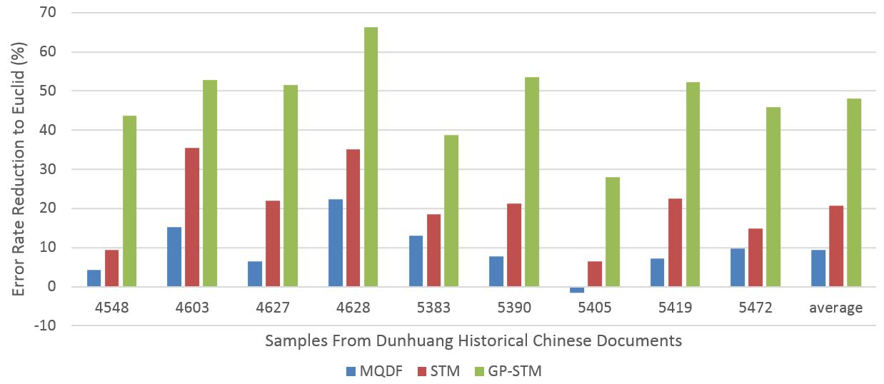

# Gaussian Process Style Transfer Mapping

This research was funded by National Natural Science Foundation of China in 2014-2015

## Background
Dunhuang historical documents are ancient Chinese documents found in Dunhuang city, Gansu Province, China. The documents can trace their history back to the Jin Dynasty (4th century A.D.) to the Yuan Dynasty (11th century A.D.). The documents are of great value for the research of religion, politics, economics and culture in ancient China. Recently, the documents are digitalized to images for better preservation, and need to be recognized to texts.

The recognition of this database is challenging because:
- item The characters are handwritten, when different styles influence the accuracy;
- item The number of classes of the historical Chinese characters is larger than other character dataset, usually over 10,000 classes. This will bring great challenges to the design and training of classifiers;
- item There are not enough samples for training. For some classes, there are not any samples for training at all.

Due to the reason mentioned above, it's not possible to train a classifier with the database itself. Transfer learning is need to help build the classifier. 

## GP-STM model

In our framework (see Fig below), the feature vectors of source dataset is different from that of target dataset in style. Through our GP-STM module, we transform the feature vectors in the target dataset into that with the style of the source dataset. In this way, the source classifier can be used effectively to classify the feature vectors in the target dataset.

To add GP-STM in recognition system, we divide target dataset into two parts as described previously. About 5% of the characters are used as the **STM training set** to learn the transformation coefficients, while the remaining 95% forms the **STM test set**. Character selection can be done either randomly, or by random selection of specific class categories from the set. In our experiments, we will show the results of both approaches.

The GP-STM module need training, in order to transform the feature vectors properly. To do this, we separate the target dataset into two parts as figure above shows. About 5% of the characters are used as the **STM training set** to learn the transformation coefficients, while the remaining 95% forms the **STM test set**. This Character separation can be done either randomly, or by random selection of specific class categories from the target dataset. In our experiments, we will show the results of both approaches.

## Results

Experiment results on Dunhuang historical documents are shown in the figure below.

From the figure we can see that GP-STM approach achieves the best accuracy. STM is better that MQDF. Euclid distance approach is worst.
